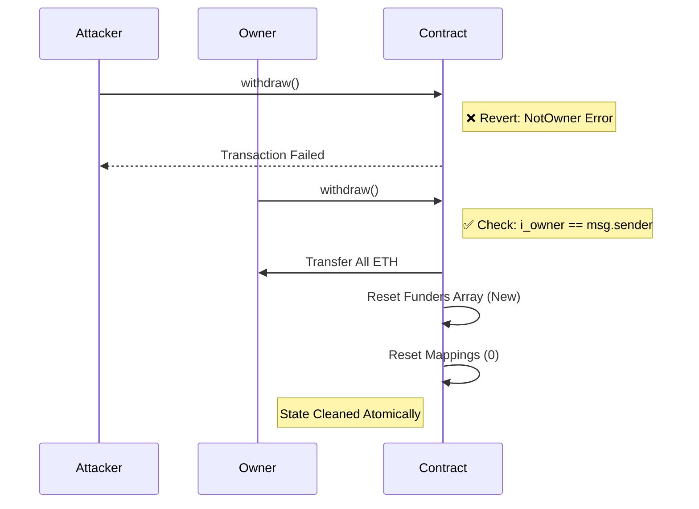

<div align="center">

  <br />
  <br />


  <h1 style="font-size: 3rem; margin-bottom: 0;">Oracle-Pegged Crowdfunding</h1>

  <p style="font-size: 1.1rem; color: #b298dc; max-width: 600px;">
    <strong>A decentralized financial infrastructure mitigating volatility via Chainlink Data Feeds.</strong><br/>
    Enforces USD-denominated funding thresholds on ETH transactions with gas-optimized architecture.
  </p>

  <p>
    <a href="https://github.com/NexTechArchitect/FundMe-Contract">
      
    </a>
    &nbsp;
    <a href="https://github.com/NexTechArchitect/FundMe-Contract">
      
    </a>
    &nbsp;
    <a href="https://chain.link/data-feeds">
      
    </a>
  </p>

  <br />

</div>

---

## 📑 Table of Contents

- [🧠 Executive Summary](#-executive-summary)
- [💱 Oracle Integration Logic](#-oracle-integration-logic)
- [⚡ Gas Optimization Engineering](#-gas-optimization-engineering)
- [🛡 Security & Access Control](#-security--access-control)
- [🚀 Deployment & Testing](#-deployment--testing)

---

## 🧠 Executive Summary

**FundMe** is a decentralized application (dApp) designed to solve the **volatility problem** in crypto crowdfunding.

Traditional crowdfunding accepts fixed ETH amounts (e.g., "Send 1 ETH"). However, if the price of ETH crashes, the project fails. This protocol enforces a **Minimum USD Contribution** (e.g., $50) by performing real-time cryptographic conversion using **Chainlink Aggregators**.

> **Core Value:** "Fund in Crypto, Denominate in Fiat."

---

## 💱 Oracle Integration Logic

The core innovation is the **Dynamic Price Conversion Library**. We utilize modular arithmetic to handle precision loss between Ethereum (18 decimals) and Chainlink Oracles (8 decimals).

### 📐 Data Flow Architecture

```mermaid
graph LR
    User((Funder))
    Contract[FundMe Contract]
    Oracle{Chainlink Oracle}
    Logic{Validation}

    User -- "1. Send ETH (wei)" --> Contract
    Contract -- "2. Request Price" --> Oracle
    Oracle -- "3. Return ETH/USD (8 dec)" --> Contract
    
    Contract -- "4. Normalize to 18 dec" --> Logic
    Logic -- "Check Value >= $50" --> Valid{Result}
    
    Valid -- "Pass" --> Accept[✅ State Update]
    Valid -- "Fail" --> Revert[❌ Revert Tx]

    style Oracle fill:#2d1b4e,stroke:#9d4edd,stroke-width:2px
    style Contract fill:#1a1a1a,stroke:#b298dc
    style Logic fill:#1a1a1a,stroke:#fff

```



### 🧮 Precision Math Specification

To ensure accuracy, we perform the following conversion:

$$ \text{USD Value} = \frac{\text{ETH Amount (wei)} \times \text{ETH Price (8 decimals)} \times 10^{10}}{10^{18}} $$

* **Adjustment:** We multiply Chainlink's price by  to match Ethereum's 18-decimal standard (`wei`).

---

## ⚡ Gas Optimization Engineering

This contract is engineered to minimize OpCode execution costs, saving users significantly on transaction fees.

| **Technique** | **Implementation Details** | **Gas Impact** |
| --- | --- | --- |
| **Bytecode Constants** | `MINIMUM_USD` is declared as `constant`. | **~2,100 Gas Saved** (No `SLOAD`). |
| **Immutable Variables** | `i_owner` is set once at deployment and stored in bytecode. | **~2,100 Gas Saved** per call. |
| **Custom Errors** | `error FundMe__NotOwner();` vs `require()`. | **Cheaper Reverts** (No string storage). |
| **Memory Caching** | Reading `funders` array length from memory during loops. | **Massive Savings** on large arrays by avoiding repeated storage reads (`SLOAD`). |

---

## 🛡 Security & Access Control

Unlike simple wallets, FundMe implements strict **State Management** patterns to prevent re-entrancy or fund theft.

### 🛡️ Secure Withdrawal Pattern



---

## 🚀 Deployment & Testing

A clean, modular layout optimized for **Foundry** development. We support **Forked Testing** to simulate real Chainlink Oracles on a local blockchain.

```text
FundMe-Contract/
├── src/
│   ├── FundMe.sol           // [CORE] Main crowdfunding logic
│   └── PriceConverter.sol   // [LIB]  Math library for 1e18 precision
├── script/
│   ├── DeployFundMe.s.sol   // [OPS]  Network-aware deployment
│   └── HelperConfig.s.sol   // [CONF] Mocks for local Anvil chains
└── test/
    ├── unit/                // [TEST] Isolated logic checks
    └── integration/         // [TEST] Full funding/withdrawal simulation

```

### 🛠 Automated Workflow

| Command | Action Performed |
| --- | --- |
| **`make build`** | Compiles smart contracts and generates ABI artifacts. |
| **`make test`** | Executes the full test suite (Unit + Integration). |
| **`make snapshot`** | Generates a gas usage report for optimization analysis. |
| **`make anvil`** | Starts a local Ethereum node for rapid debugging. |

---

<div align="center">


<b>Engineered by NEXTECHARHITECT</b>


<i>Smart Contract Developer · Solidity · Foundry · Web3 Engineering</i>


<a href="https://github.com/NexTechArchitect">GitHub</a> •
<a href="https://www.google.com/search?q=https://twitter.com/NexTechArchitect">Twitter</a>
</div>

```

```
