<div align="center">
  

  <br/>

  <p>
    <a href="https://github.com/NexTechArchitect/FundMe-Contract">
      
    </a>
    

  </p>

  <h3>💸 A Decentralized & USD-Pegged ETH Crowdfunding Contract</h3>
  <p width="80%">
    <b>Production-grade funding infrastructure.</b><br/>
    Allows users to fund projects in ETH while strictly enforcing a USD minimum threshold via real-time Chainlink Oracles.
  </p>

  <br/>

  <h3>📚 Topic Navigation</h3>
  <p>
    <a href="#-funding-logic--oracle-flow"><strong>💱 Funding Logic</strong></a> &nbsp;|&nbsp;
    <a href="#-withdrawal--security"><strong>🔐 Security</strong></a> &nbsp;|&nbsp;
    <a href="#-gas-optimization--internals"><strong>⚡ Internals</strong></a> &nbsp;|&nbsp;
    <a href="#-directory-structure"><strong>📂 Structure</strong></a>
  </p>

</div>

---

## 📖 Executive Summary

**FundMe** is a decentralized application (dApp) that solves the volatility problem in crypto crowdfunding.

Instead of asking for "1 ETH" (which changes value daily), this contract enforces a **Minimum USD Contribution** (e.g., $50). It achieves this by fetching the live **ETH/USD** price from Chainlink Data Feeds during every transaction, ensuring the funding goal is met regardless of market conditions.

---

## 💱 Funding Logic & Oracle Flow

The core innovation of this contract is the **Dynamic Price Conversion**.

### 📐 Price Conversion Data Flow

```mermaid
graph LR
    User((Funder))
    Contract[FundMe Contract]
    Oracle{Chainlink Oracle}
    Logic{Validation}

    User -- "1. Send ETH (wei)" --> Contract
    Contract -- "2. Request Price" --> Oracle
    Oracle -- "3. Return ETH/USD Price" --> Contract
    
    Contract -- "4. Calculate USD Value" --> Logic
    Logic -- "Value >= Min USD?" --> Valid{Yes/No}
    
    Valid -- "Yes" --> Accept[✅ Accept & Track User]
    Valid -- "No" --> Revert[❌ Revert Transaction]

```



### 🧮 Math Specification

The contract ensures precision by handling Ethereum's 18 decimal places:

---

## 🔐 Withdrawal & Security Architecture

Unlike simple wallets, FundMe implements strict **Access Control** and **State Management** to prevent re-entrancy or theft.

### 🛡️ Owner-Only Withdrawal Flow

```mermaid
sequenceDiagram
    participant Attacker
    participant Owner
    participant Contract

    Attacker->>Contract: withdraw()
    Note right of Contract: ❌ Revert: NotOwner Custom Error
    Contract-->>Attacker: Transaction Failed

    Owner->>Contract: withdraw()
    Note right of Contract: ✅ Check: i_owner == msg.sender
    
    Contract->>Owner: Transfer All ETH
    Contract->>Contract: Reset Funders Array
    Contract->>Contract: Reset Mappings (0)
    Note left of Contract: State is Cleaned

```



---

## ⚡ Gas Optimization & Internals

This contract is engineered to be **Gas Efficient**. We utilize specific Solidity features to reduce deployment and execution costs.

| **Optimization** | **Technical Explanation** | **Impact** |
| --- | --- | --- |
| **`immutable` Variables** | The `i_owner` variable is stored directly in the contract bytecode, not storage. | **Saves ~2,100 Gas** per read (Avoids `SLOAD`). |
| **`constant` Variables** | The `MINIMUM_USD` value is replaced at compile-time. | **Zero Gas Cost** for access. |
| **Custom Errors** | Uses `error FundMe__NotOwner();` instead of `require("Not Owner")`. | **Cheaper Reverts** (No string storage). |
| **Memory Caching** | The withdrawal loop reads the array length from `memory` instead of `storage` every iteration. | **Massive Savings** on large arrays. |

---

## 📂 Directory Structure

A clean, modular layout optimized for Foundry development.

```text
FundMe-Contract/
├── src/
│   ├── FundMe.sol           // [CORE] Main crowdfunding & withdrawal logic
│   └── PriceConverter.sol   // [LIB]  Chainlink Oracle math library
├── script/
│   ├── DeployFundMe.s.sol   // [OPS]  Network-aware deployment script
│   └── HelperConfig.s.sol   // [CONF] Mock config for local testing
└── test/
    ├── unit/                // [TEST] Isolated function testing
    └── integration/         // [TEST] Full funding & withdrawal simulation

```

---

## 🛠 Makefile Workflow


| Command | Action Performed |
| --- | --- |
| **`make build`** | Compiles all smart contracts and generates ABI artifacts. |
| **`make test`** | Executes the full test suite (Unit + Integration) with verbosity. |
| **`make deploy`** | Deploys the contract to the network defined in your `.env` file (Sepolia). |
| **`make anvil`** | Starts a local Ethereum node for rapid testing and debugging. |
| **`make format`** | Auto-formats solidity code to standard style guidelines. |


---

<div align="center">


<h3>Engineered by NexTechArchitect</h3>
<p><i>Solidity • Foundry • DeFi Engineering</i></p>


<a href="https://github.com/NexTechArchitect">

</a>
&nbsp;&nbsp;
<a href="https://linkedin.com/in/amit-kumar-811a11277">

</a>
&nbsp;&nbsp;
<a href="https://x.com/itZ_AmiT0">

</a>

</div>

```

```
